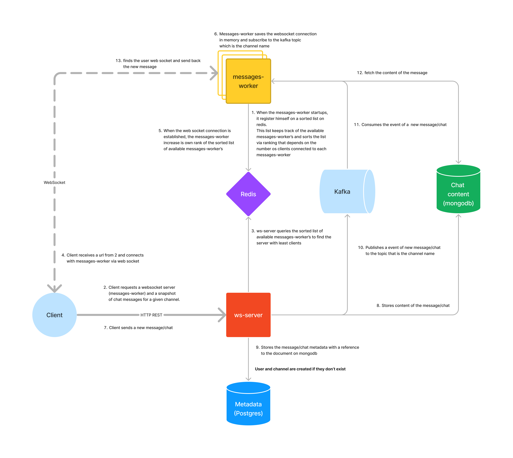

# Chat

## Usage

On the root of the project

`docker-compose up`

And use the REST API of `ws-server` to known which websocket server (messages-worker) to connect, to
post/create new messages, list chats by channel.

> For testing purposes new channels and users will be created if they do not exist on the db.

# Architecture

<!-- https://www.figma.com/file/2tunX2j3ZTgNXwn1IvNVks/scalable-chat?type=whiteboard&node-id=0-1&t=8zuWSqqSJTIccE7P-0 -->



## Example on how to use the chat

`GET http://localhost:8080/connect/my-channel?snapshot=true (HEADER -> user: my-user)`

```
{
    "webSocket": {
        "baseWebsocket": "ws://172.18.0.7:9090",
        "websocket": "ws://172.18.0.7:9090/connect/my-channel?user=my-user",
        "user": "mae",
        "channel": "ola2"
    },
    "chat": {
        "messages": [
            {
                "content": "Hello",
                "createdAt": "2023-08-29T13:39:25.499",
                "userName": "my-user"
            },
            {
                "content": ":)",
                "createdAt": "2023-08-29T13:39:25.499",
                "userName": "my-user-1"
            }
        ]
    }
}
```

`ws:///172.18.0.7:9090/connect/my-channel?user=my-user`

> On local env the ip should be localhost instead of the ip

`POST http://localhost:8080/chat/my-channel (HEADER -> user: my-user)`
with a json body like:

```
{
    "content": "message"
}
```
